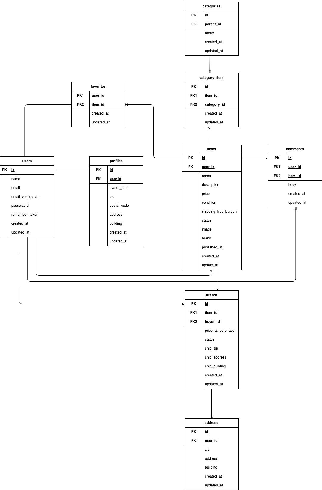

# フリマアプリ
本アプリは、Laravelを用いて開発した模擬フリマアプリです。

## 📦環境構築

### Dockerのビルド
```
git clone git@github.com:satomayuko/fleamarket-app.git
cd fleamarket-app
docker-compose up -d --build
```


### Laravel環境構築
```
docker-compose exec php bash
composer install
```

### .envファイルの作成と設定
```
cp .env.example .env
```
.env ファイルには以下のように設定します
```env
DB_CONNECTION=mysql
DB_HOST=mysql
DB_PORT=3306
DB_DATABASE=laravel_db
DB_USERNAME=laravel_user
DB_PASSWORD=laravel_pass
```

### アプリケーションキーの生成
アプリケーションキーを生成し .env に自動設定します：
```
docker-compose exec php bash
php artisan key:generate
```

### データベースマイグレーション（Migration）
下記コマンドでマイグレーション、シーディングを実行します
```
docker-compose exec php bash
php artisan migrate
php artisan db:seed
```

## 🔧 使用技術(実行環境)

- **PHP** 8.0.30(Dockerコンテナ内)
- **Laravel** 8.83.8
- **MySQL** 8.0.26
- **Docker**（環境構築用：nginx, php, mysql）
- **jQuery** 3.7.1
- **nginx** 1.21.1

## 🗺 ER図


## 🌐URL
- 開発環境: http://localhost/
- ユーザー登録: http://localhost/register
- phpMyAdmin: http://localhost:8080

## 👤 ログイン情報
一般ユーザー
- ユーザー名: テストユーザー
- email: test@example.com
- password: 12345678
